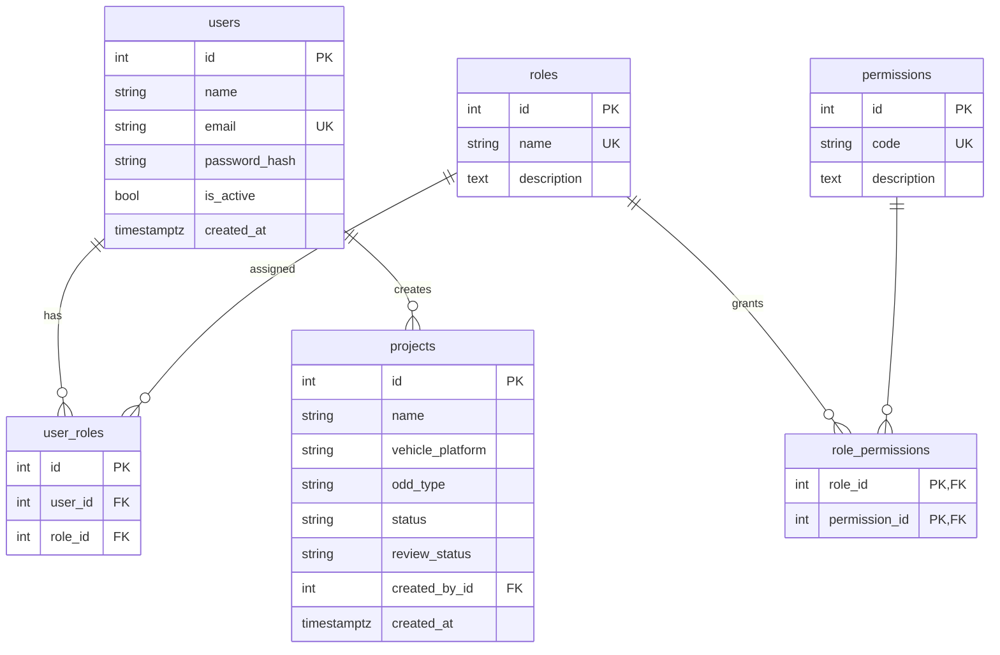
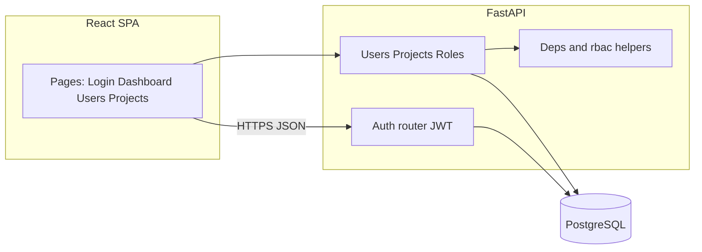
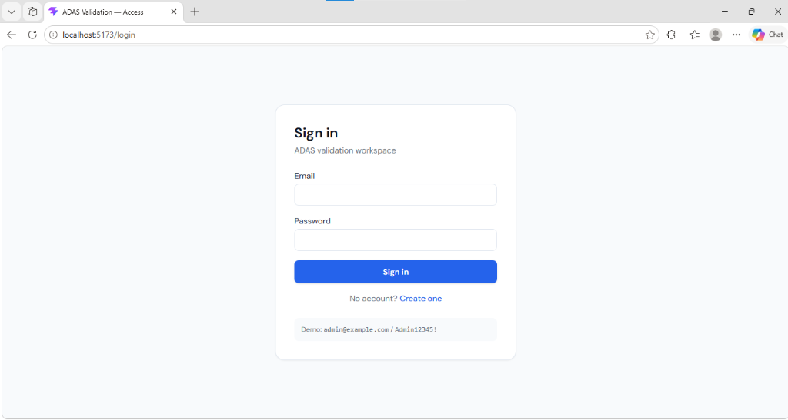
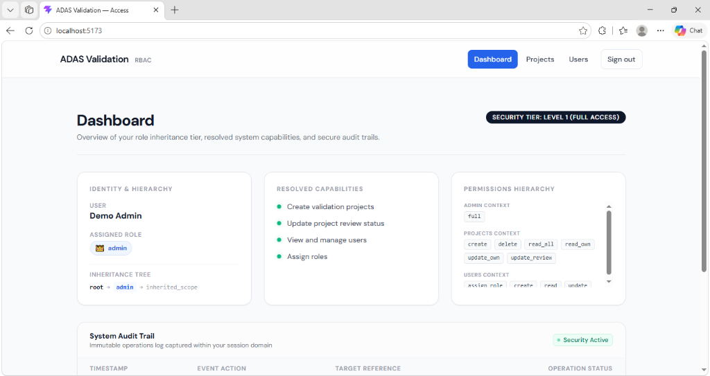
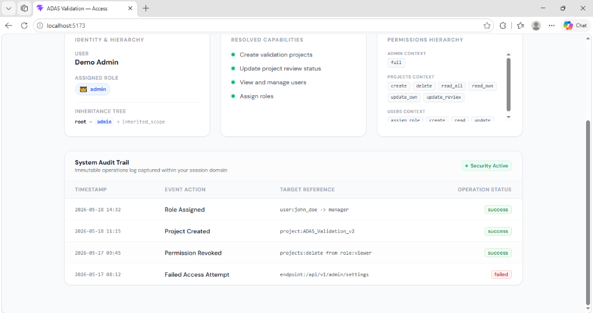
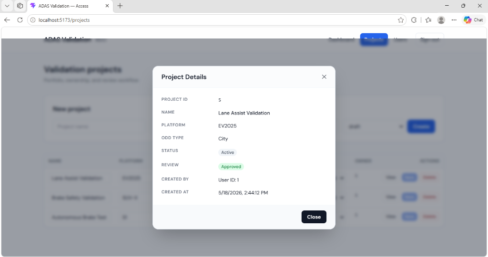
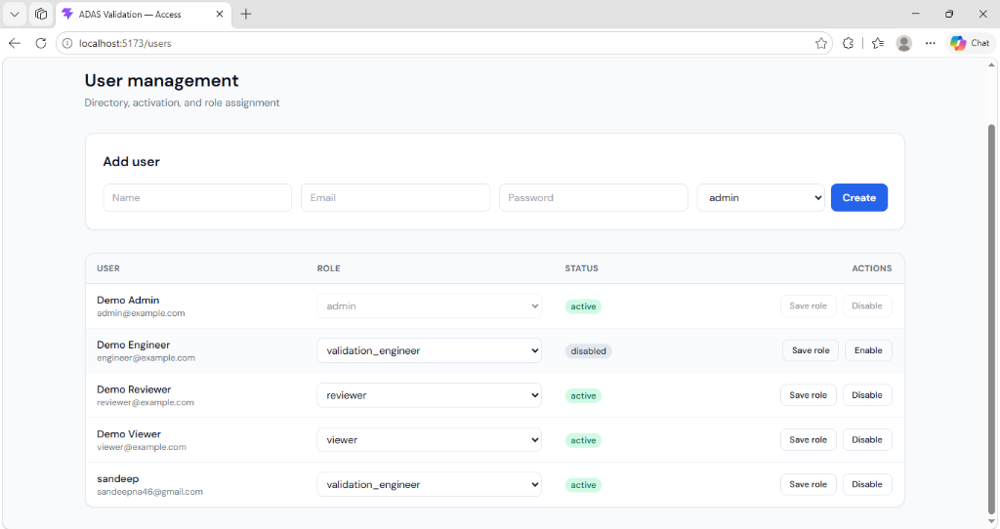

# ADAS Validation Platform — User Management & RBAC

Mini-module for an AI-powered ADAS validation platform: **JWT authentication**, **password hashing**, **PostgreSQL** persistence via SQLAlchemy (`postgresql+psycopg://`), **permission-based RBAC**, **validation projects** with ownership and review workflow, and a **React + TypeScript + Tailwind** admin UI (login, dashboard, users, projects, role assignment).

## Quick start

### Option A — Full project (PostgreSQL in Docker + local API + UI)

Requires [Docker Desktop](https://www.docker.com/products/docker-desktop/). The repo ships **`docker-compose.yml`** with **only the database**; the FastAPI app and Vite UI still run on your machine (hot reload preserved).

```powershell
cd c:\
docker compose up -d    
```

Wait until Postgres is ready, then in **two terminals**:

```powershell
cd c:\backend
pip install -r requirements.txt
python -m uvicorn app.main:app --reload --host 127.0.0.1 --port 8088
```

```powershell
cd c:\frontend
npm install
npm run dev
```

**Windows shortcut:** from `c:\`, run `.\scripts\run-dev.ps1` — it starts `docker compose`, waits for `pg_isready`, then opens new windows for the API and UI.

- API: `http://127.0.0.1:8088` (docs: `/docs`)
- UI: `http://localhost:5173` (Vite may use another port if 5173 is busy)
- DB: `localhost:5432` — user `adas`, password `adas`, database `adas_validation`

### Option B — PostgreSQL you install yourself (no Docker)

Create role and database (names must match `DATABASE_URL` in `backend/.env` or the default in `backend/app/config.py`):

```sql
CREATE USER adas WITH PASSWORD 'adas';
CREATE DATABASE adas_validation OWNER adas;
```

Copy `backend/.env.example` to `backend/.env` if you need custom `DATABASE_URL` / `JWT_SECRET`.

Then run the same **backend** and **frontend** commands as in option A.

### Demo accounts (seeded on API startup)

| Email                 | Password       | Role                 |
| --------------------- | -------------- | -------------------- |
| `admin@example.com`   | `Admin12345!`  | admin                |
| `engineer@example.com`| `Demo12345!`   | validation_engineer |
| `reviewer@example.com`| `Demo12345!`  | reviewer             |
| `viewer@example.com`  | `Demo12345!`   | viewer               |

Change or remove demo seeding before any real deployment.

Use `backend/.env` for `DATABASE_URL`, `JWT_SECRET`, and CORS overrides (`backend/.env.example` is a template).

## API overview

| Method & path            | Description                                      | Auth / notes                          |
| ------------------------ | ------------------------------------------------ | ------------------------------------- |
| `POST /login`            | Assignment-compatible alias for login          | Public                                |
| `POST /api/auth/login`   | Login, returns JWT                               | Public                                |
| `POST /api/auth/register`| Signup (admin role blocked)                      | Public                                |
| `GET /api/auth/me`       | Current user + flattened permission codes      | Bearer JWT                            |
| `GET /api/roles`         | Roles with permission lists                      | Public (for signup & admin UI)        |
| `GET /api/users`         | List users                                       | `users:read`                          |
| `POST /api/users`        | Create user                                      | `users:create`                        |
| `PUT /api/users/{id}/role` | Assign role                                    | `users:assign_role`                   |
| `PATCH /api/users/{id}/active` | Enable/disable account                     | `users:update`                       |
| `GET /api/projects`      | Projects visible under RBAC                      | Bearer JWT                            |
| `POST /api/projects`     | Create project                                   | `projects:create`                     |
| `PUT /api/projects/{id}` | Update project / review status                   | Rules in `app/routers/projects.py`  |
| `DELETE /api/projects/{id}` | Delete project                                | `projects:delete`                     |

## RBAC model

### Roles (seeded)

| Role                 | Intent |
| -------------------- | ------ |
| **admin**            | Full access (`admin:full` plus explicit permission codes). |
| **validation_engineer** | Create projects; view all projects; edit **own** project fields. |
| **reviewer**         | View all projects; update **review_status** only. |
| **viewer**           | View all projects (read-only). |

### Permission codes (excerpt)

- `admin:full` — bypass for administrators.
- `users:*` — directory operations (read/create/update/assign_role).
- `projects:create`, `projects:read_all`, `projects:read_own`, `projects:update_own`, `projects:update_review`, `projects:delete`.

Authorization is enforced in FastAPI dependencies (`require_permissions`) and in project route handlers (`app/rbac.py`).

## Database schema

Tables: `users`, `roles`, `permissions`, `role_permissions`, `user_roles` (one role per user enforced by app + unique constraint on `user_id`), `projects`.




## Architecture



## Screenshots / demo

Here are screenshots of the running application:

### 1. Login Screen


### 2. Dashboard (Role & Permission Summary)



### 3. Projects List & Details (Ownership & Review Workflow)


### 4. Users Table & Role Assignment (Admin UI)


## Project layout

```
backend/           FastAPI app (app/main.py, routers, rbac, seed)
frontend/          Vite + React + TS + Tailwind
docker-compose.yml PostgreSQL only (optional local DB)
scripts/run-dev.ps1 Windows helper: compose + API + UI windows
README.md
```

## Security notes

- Replace `JWT_SECRET` and demo passwords for any shared or production environment.
- HTTPS termination should sit in front of the API in real deployments.
- Registration allows choosing a non-admin role; admin accounts should be provisioned by trusted operators.

